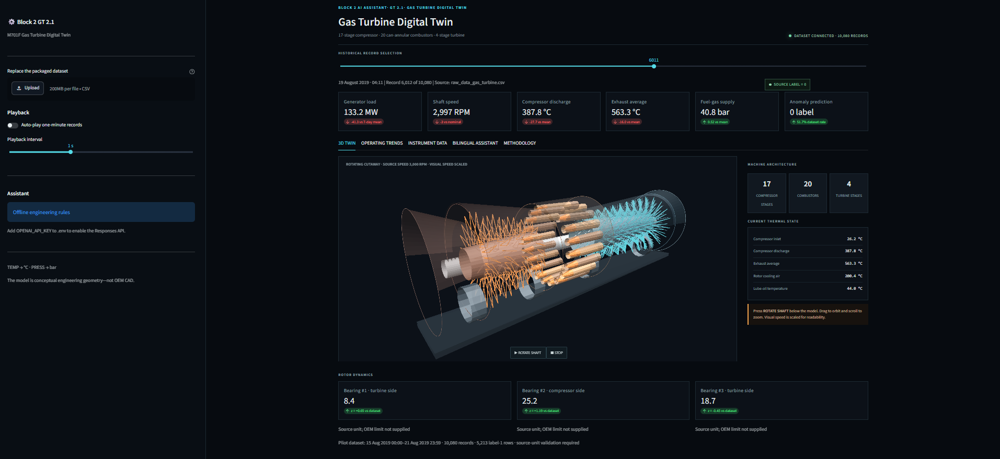
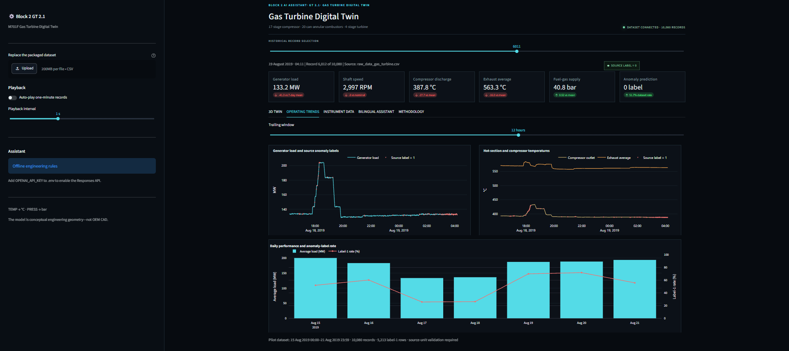
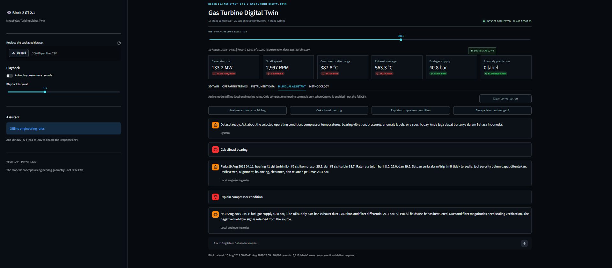

# Gas Turbine Digital Twin — Python Pilot Project

This is a first pilot project for an industrial M701-F gas-turbine digital twin. It combines historical operating data, an interactive rotating 3D cutaway, trend analysis, source anomaly labels, and a bilingual English/Bahasa Indonesia maintenance assistant.

The packaged machine architecture contains:

- 17 axial-compressor rotor stages with stationary stator rows
- 20 can-annular combustors arranged circumferentially
- 4 turbine rotor stages with stationary stator rows
- One common rotating shaft, rotor drums, bearings, inlet casing, combustion casing, turbine casing, and exhaust diffuser

The geometry is a detailed, procedural engineering visualization. Its overall architecture follows the [Mitsubishi Power M701F specifications](https://power.mhi.com/products/gasturbines/lineup/m701f/): 17 compressor stages, 20 combustors, four turbine stages, one shaft, two bearing supports and a compressor-end output coupling. Dimensions, airfoil profiles, blade counts within each row, piping and hardware are illustrative. This is not OEM CAD or a thermodynamic simulation.

## Detailed 3D viewer

The machine explorer uses locally bundled Three.js with solid curved blade meshes, metal materials, studio reflections, shadows, bolted casing flanges, combustor transition ducts and stationary guide vanes. The upper casing can be restored for an exterior view. Use the camera selector to inspect the compressor, combustion section, turbine or axial inlet; drag to orbit, scroll to zoom and right-drag to pan.

The common rotor turns continuously at **1/600 of recorded shaft speed** for inspection. Pause freezes only the visualization. Zero or unavailable speed stops rotation. Display motion is capped for source readings above 12,000 RPM. Casing, bearings, combustors and stators remain stationary. The viewer preserves inspection controls during historical-record changes and pauses drawing when off screen. Reduced-motion browser preferences start rotation paused.

Materials do not represent measured metal temperatures. The three vibration channels retain their source names; their mapping onto the two modeled bearing supports is not established by the dataset.

Run the application with Python 3.10+:

```powershell
python -m pip install -r requirements.txt
python -m streamlit run app.py
```

The existing operating-data CSV must be available at `data/raw_data_gas_turbine.csv`, or supplied using the uploader. The data files are excluded by `.gitignore`. The 3D viewer requires a browser with WebGL2 and graphics acceleration. Its graphics dependencies are included in `src/viewer/turbine.bundle.js`; Node.js and an internet connection are not required to display the model.

For frontend development only, rebuild the checked-in bundle after changing `src/viewer/viewer.js` or `src/viewer/geometry.js`:

```powershell
npm ci
npm run build:viewer
npm run test:geometry
python -m pytest -q
```

Three.js is pinned to 0.180.0 and its MIT license is included in `src/viewer/THREE-LICENSE.txt`. The optional `tests/browser_smoke.py` checks animation, viewing controls, dataset synchronization and mobile layout against a running app with external network requests blocked. Install Playwright separately (`python -m pip install playwright`); the script uses an existing Google Chrome installation.

## Main features

- Runs locally in Visual Studio Code using Streamlit.
- Includes the original `raw_data_gas_turbine.csv` with 10,080 one-minute records.
- Interprets `TEMP` measurements as °C and `PRESS` measurements as bar.
- Replays every historical record with an optional automatic playback mode.
- Displays generator load, shaft speed, compressor discharge temperature, exhaust temperature, fuel-gas pressure, and the existing anomaly label.
- Provides load, thermal, bearing-vibration, daily-performance, and anomaly-label trends.
- Shows every original CSV channel in an instrument register.
- Rotates the compressor and turbine blades while the combustors, stators, and casing remain stationary.
- Answers questions in English or Bahasa Indonesia.
- Works without an API key using deterministic engineering rules.
- Optionally uses the OpenAI Responses API when `OPENAI_API_KEY` is configured.


If the browser does not open, copy the local address shown in the terminal, normally:

```text
http://localhost:8501
```

Never paste an API key directly into Python source code. The `.gitignore` file excludes `.env`, but if a key is ever pushed to GitHub, revoke it immediately and create a new key.


### The OpenAI assistant uses local fallback

Check that `.env` exists, `OPENAI_API_KEY` has a valid active key, your API project can access the selected model, billing is enabled, and Streamlit was restarted after editing `.env`.

## Project status

This repository is intentionally a pilot and learning project. Future development can add a trained anomaly-detection pipeline, OEM-configurable thresholds, database integration, per-sensor quality flags, role-based access, work-order recommendations, and connection to a validated historian API.
